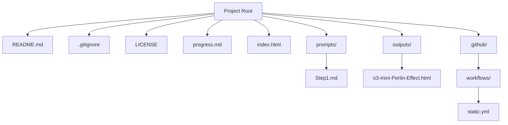

# Codebase Structure Diagram

This diagram represents the current structure of the repository. Use it as a reference to understand what files and directories are present.

You can chat with this structure by referring to the file names and paths shown above (e.g., ask about the contents of `prompts/Step1.md` or `.github/workflows/static.yml`). 